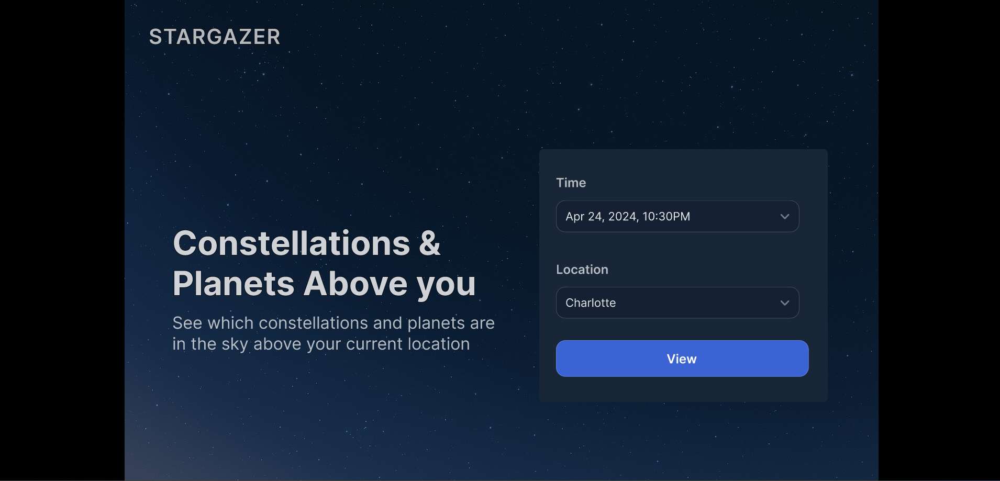

Star Gazer
Star Gazer is an interactive web app that lets users explore the night sky from any point in time and space. Whether you’re curious about what the stars looked like on your birthday, during a historical event, or at a future date, Star Gazer brings the cosmos to your fingertips.
The app provides:
🌠 Real-time celestial visualization – view constellations, planets, and stars as they appeared at a chosen date and location.
♈ Astrological insights – discover zodiac constellations and horoscope alignments associated with specific times.
🗺️ Interactive map interface – easily select global locations and times using an intuitive, responsive design.
📱 Educational and personal use – perfect for astronomy enthusiasts, students, or anyone interested in the connection between the stars and human experience.
Built with modern web technologies for performance and clarity, Star Gazer aims to make stargazing accessible, visual, and meaningful — all from your browser.



# How to run
Provide here instructions on how to use your application.   
- Download the latest binary from the Release section on the right on GitHub.  
- On the command line uncompress using
```
tar -xzf  
```
- On the command line run with
```
./hello
```
- You will see Hello World! on your terminal. 

# How to contribute
Follow this project board to know the latest status of the project: [http://...]([http://...])  

### How to build
- Use this github repository: ... 
- Specify what branch to use for a more stable release or for cutting edge development.  
- Use InteliJ 11
- Specify additional library to download if needed 
- What file and target to compile and run. 
- What is expected to happen when the app start. 
